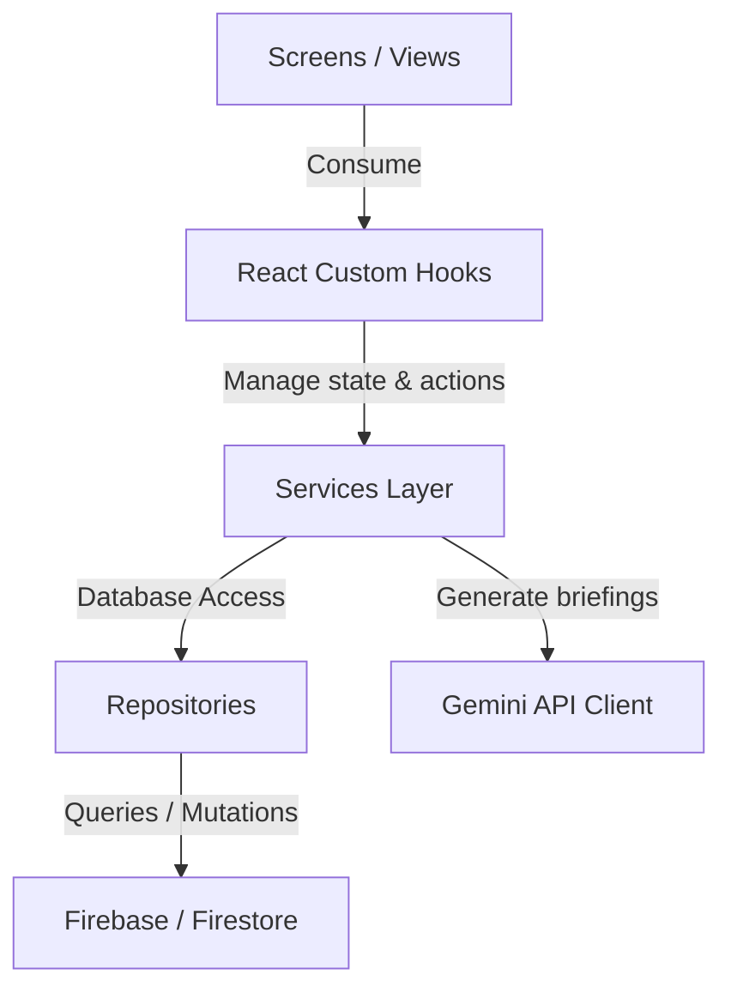

# Architecture & Separation of Concerns

This document details the architectural boundaries for **JanArogya Netra**.

## 🏗️ Separation of Concerns (SoC)

The project enforces a strict, uni-directional flow of data and dependencies to guarantee frontend and backend layers remain completely decoupled.

### 1. View Layer (`app/`, `components/`)
- Renders UI elements and captures user actions.
- Uses **NativeWind** (Tailwind CSS) for responsive layouts.
- **Rules**: Must NEVER import `firebase/*`, `@google/generative-ai`, or perform direct Axios HTTP requests. All dynamic data must be consumed from custom hooks in the `hooks/` folder.

### 2. State & Hooks Layer (`hooks/`, `store/`)
- Acts as the connector between the view and business services.
- Exposes clean React custom hooks (e.g. `useAlerts`, `usePHCs`) wrapping Zustand state and service callbacks.
- **Rules**: Exposes state variables (loading, error, data) and trigger methods. Does not handle layouts.

### 3. Service Layer (`services/`)
- Contains domain business logic (redistribution algorithms, scenario simulation managers, AI prompts).
- Connects to repositories and generative models.
- **Rules**: Fully independent of React rendering lifecycle.

### 4. Repository Layer (`services/repositories/`)
- Manages reading/writing data from Firebase Firestore or local cache fallbacks.
- **Rules**: Decouples the database engine (Firestore) from the rest of the application. If the database schema changes, only the repository layer needs modification.
