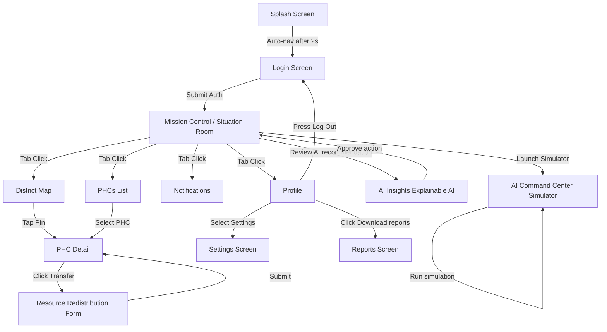

# Navigation Flow & UI Transitions

This document defines the screen-to-screen transitions and navigation paths in the application.

---

## 🗺️ Core User Flow Chart

---

## 🧭 Navigation Paths Details

### 1. Main Navigation Paths (Main flows)
- **App Startup Flow**:
  `Splash` → `Login` → `Mission Control`
- **Facility Update Flow**:
  `PHCs List` → `PHC Detail` → `Resource Redistribution`
- **AI Decision Workflow**:
  `Mission Control` → `AI Insights` → `Explainable AI` → `Approve` → `Mission Control`
- **Emergency Drill Flow**:
  `Mission Control` → `AI Command Center` → `Scenario Simulator` → `Verify results`

### 2. Tab Navigation Structure
The root of the main application layout uses a Tab Navigator (`app/(tabs)/_layout.tsx`) which wraps:
- **Tab 1: Situation Room** (`app/(tabs)/situation-room.tsx`)
- **Tab 2: District Map** (`app/(tabs)/district-map.tsx`)
- **Tab 3: PHCs Directory** (`app/(tabs)/phcs.tsx`)
- **Tab 4: Notifications Feed** (`app/(tabs)/notifications.tsx`)
- **Tab 5: User Profile** (`app/(tabs)/profile.tsx`)

### 3. Screen Navigation Transitions Table

| Source Screen | Target Screen | Action Trigger | Animation Type |
|---|---|---|---|
| `Splash` | `Login` | Auto timeout (2000ms) | Replace (No back stack) |
| `Login` | `Mission Control` | Click "Log In" button | Replace (No back stack) |
| `Mission Control` | `AI Insights` | Tap "AI Recommendation" card | Stack Slide Up |
| `AI Insights` | `Explainable AI` | Tap "Explain Score" action button | Stack Slide Right |
| `PHCs List` | `PHC Detail` | Tap facility list item | Stack Slide Right |
| `PHC Detail` | `Resource Redistribution` | Tap "Transfer Stocks" button | Stack Slide Up |
| `Profile` | `Settings` | Tap "Settings" row item | Stack Slide Right |
| `Profile` | `Reports` | Tap "View Reports" row item | Stack Slide Right |
| `Profile` | `Login` | Tap "Log Out" button | Replace (No back stack) |
